# 🌟 Stellar Escrow Flow

**Decentralized Milestone-Based Escrow Platform on Stellar Blockchain**

A production-ready escrow platform built on Stellar's Soroban smart contracts with IPFS decentralized storage, dual review system, and role-agnostic architecture for seamless freelance payments.

---

## 🎯 Stellar Blue Belt Submission

Production-hardened dApp with smart contract security, IPFS integration, dual feedback system, and comprehensive user validation.

---

## 🏛️ Architecture Overview

```
┌──────────────────────────────────────────────────────────────────┐
│                    FRONTEND (React + TypeScript)                 │
│  ┌──────────────┐ ┌──────────────┐ ┌──────────────┐            │
│  │   Wallet     │ │  Milestone   │ │   Profile    │            │
│  │   Selector   │ │  Manager     │ │   Dashboard  │            │
│  └──────┬───────┘ └──────┬───────┘ └──────┬───────┘            │
│         │                │                │                      │
│         └────────────────┴────────────────┘                      │
│                          │                                       │
│              ┌───────────┴────────────┐                         │
│              │  Stellar SDK + IPFS    │                         │
│              └───────────┬────────────┘                         │
└──────────────────────────┼──────────────────────────────────────┘
                           │ ← HTTPS/REST API + Soroban RPC
┌──────────────────────────┼──────────────────────────────────────┐
│                    BACKEND (Node.js + Express)                   │
│  ┌────────────────────┐     │     ┌────────────────────┐       │
│  │   API Routes       │◄────┘     │  Business Logic    │       │
│  │ • /escrow          │           │ • Contract Service │       │
│  │ • /milestone       │           │ • IPFS Service     │       │
│  │ • /feedback        │           │ • Auth Middleware  │       │
│  │ • /profile         │           │ • Role Auth        │       │
│  │ • /users           │           └────────┬───────────┘       │
│  └────────┬───────────┘                    │                   │
│           │              ┌─────────────────┴────────┐          │
│  ┌────────┴───────────┐  │  Supabase Service        │          │
│  │  Stellar Service   │──│  (PostgreSQL + Adapter)  │          │
│  │  (Soroban RPC)     │  └──────────────────────────┘          │
│  └────────────────────┘                                         │
└──────────────────────────────────────────────────────────────────┘
                           │
┌──────────────────────────┼──────────────────────────────────────┐
│                 SMART CONTRACTS (Soroban)                        │
│  ┌─────────────────────────────────────────────────┐            │
│  │ EscrowContract                                  │            │
│  │ • create_milestone  — Create escrow agreement   │            │
│  │ • fund_milestone    — Lock XLM in contract      │            │
│  │ • submit_milestone  — Freelancer submits work   │            │
│  │ • approve_milestone — Release payment           │            │
│  │ • get_milestone     — Query milestone state     │            │
│  └─────────────────────────────────────────────────┘            │
└──────────────────────────────────────────────────────────────────┘
                           │
┌──────────────────────────┼──────────────────────────────────────┐
│                      SUPABASE (PostgreSQL)                       │
│  ┌────────────┐ ┌────────────┐ ┌────────────┐                 │
│  │   User     │ │  Escrow    │ │ Milestone  │                 │
│  │  Feedback  │ │ AgentLog   │ │ TxLog      │                 │
│  └────────────┘ └────────────┘ └────────────┘                 │
└──────────────────────────────────────────────────────────────────┘
                           │
┌──────────────────────────┼──────────────────────────────────────┐
│                      IPFS (Pinata)                               │
│  • Decentralized file storage                                   │
│  • Content addressing (CID)                                     │
│  • Permanent work submissions                                   │
└──────────────────────────────────────────────────────────────────┘
```

---

## ✅ Submission

### Required Documentation

**Live Demo Link**  
🚀 **Deployed Application**: [https://stellar-escrow-flow.vercel.app](https://stellar-escrow-flow.vercel.app)

**🎥 Demo Video**: [Watch on YouTube](#) *(Link to be added)*

### Contract Addresses & Transaction Hash

**Smart Contract ID**:  
`CBJNQEIZ2CGPI4TRGVGMGKA7UYWNMUB2WJ3JVXW4IFHVHOW3Y4KV6JWL`  
🔍 [Verify on Stellar Explorer](https://stellar.expert/explorer/testnet/contract/CBJNQEIZ2CGPI4TRGVGMGKA7UYWNMUB2WJ3JVXW4IFHVHOW3Y4KV6JWL)

### 📸 Application Screenshots

<details>
<summary>Click to view all 11 screenshots</summary>

#### Landing Page
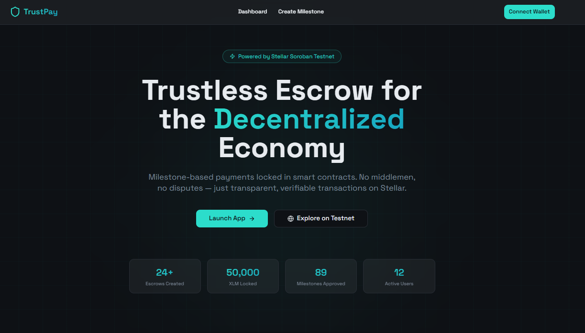  
*Modern landing page with active users and latest reviews*

#### User Profile
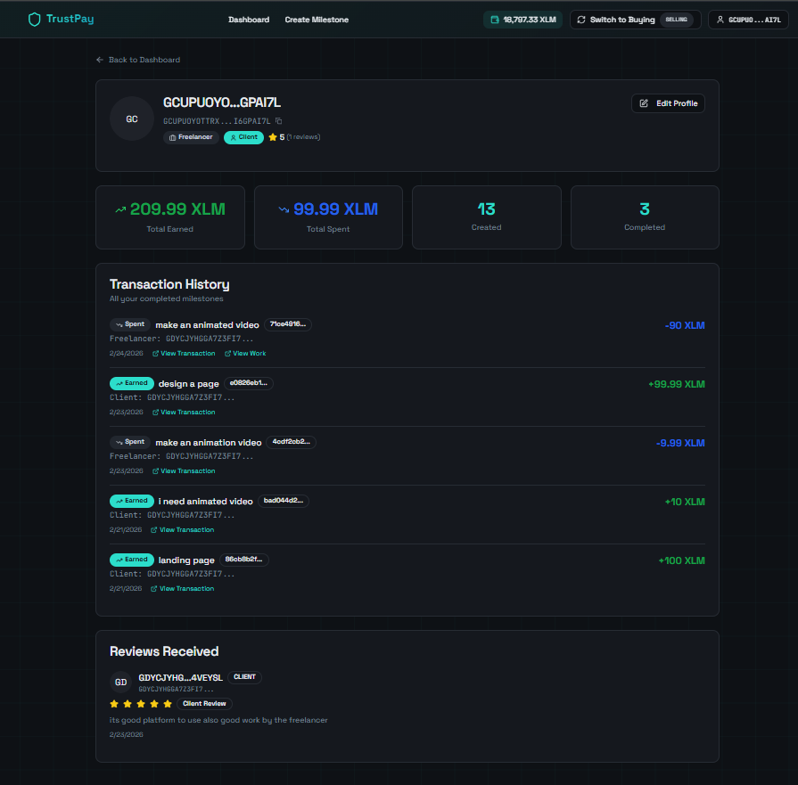  
*User profile with statistics and reputation*

#### Active Users
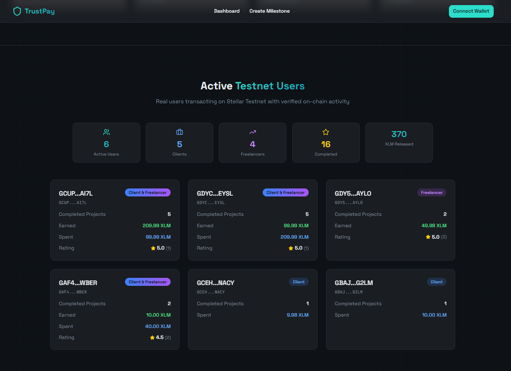  
*Active users with dynamic role computation*

#### Milestone Funded
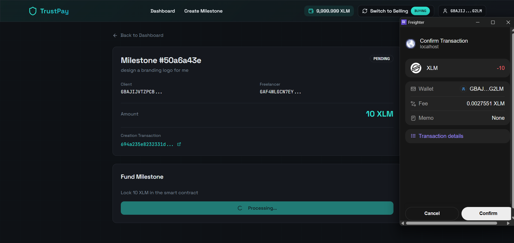  
*Milestone successfully funded with XLM locked in contract*

#### IPFS Upload
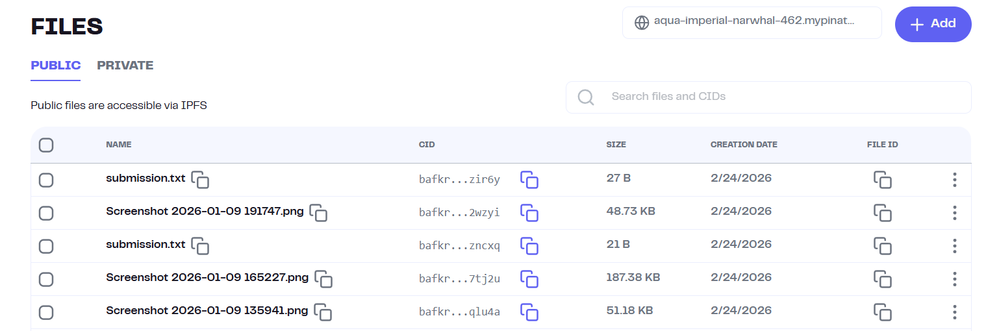  
*Three upload options: file, text, or existing CID*

#### Upload Work
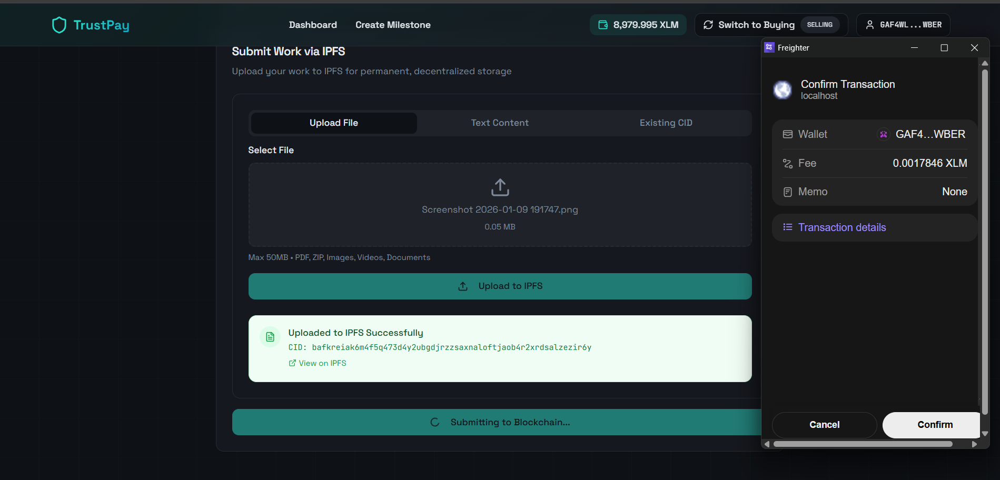  
*Freelancer submitting work with IPFS integration*

#### Feedback System
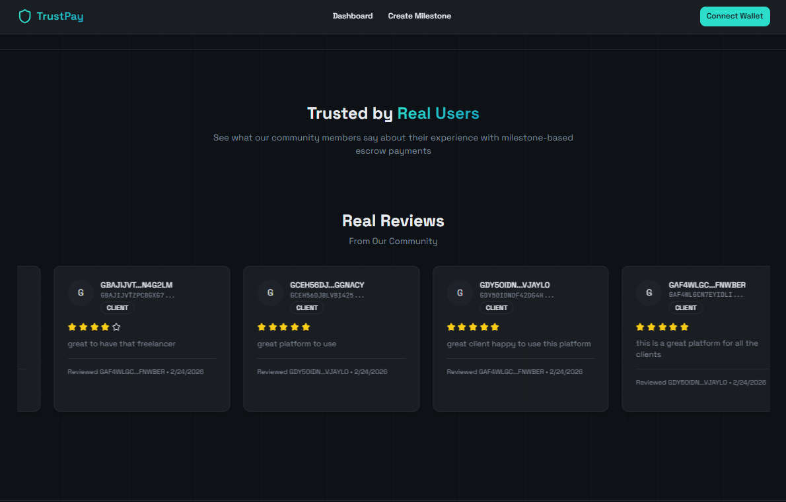  
*Dual review system for mutual feedback*

#### Reviews Display
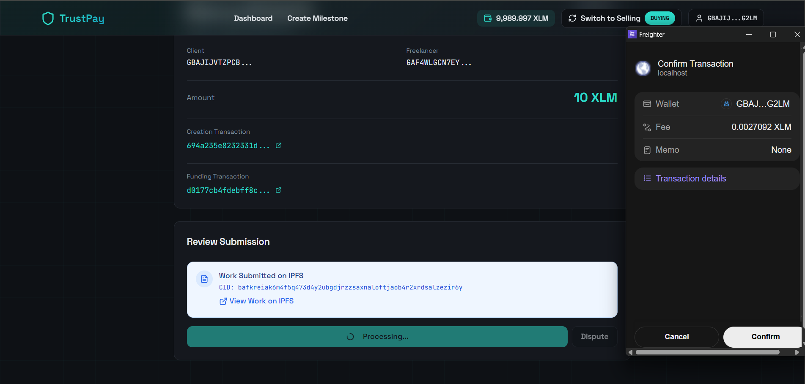  
*Public reviews displayed on landing page*

#### Smart Contract Deployment
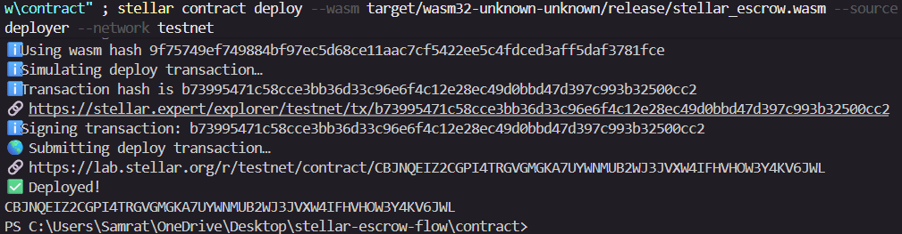  
*Smart contract deployed on Stellar Testnet*

#### Contract Verification
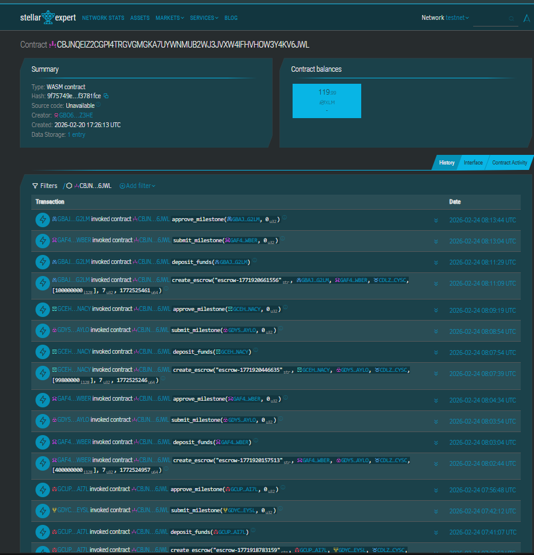  
*Contract verified on Stellar Explorer*

#### Database Schema
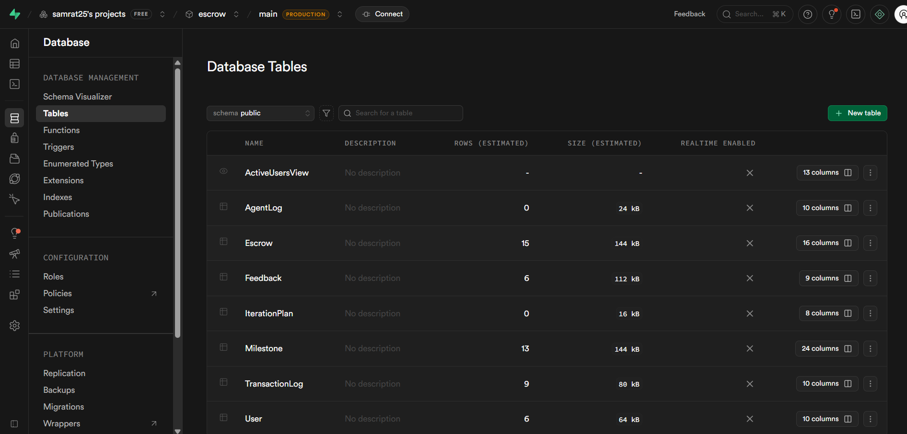  
*Supabase database with all tables configured*

</details>

---


## ✨ Features

### Core Features (Blue Belt Requirements)

**🔐 Smart Contract Security**
- Trustless Escrow — Funds locked in Soroban smart contracts
- Milestone-Based Payments — Release funds incrementally as work progresses
- Automatic Fallback — Graceful degradation when contract unavailable
- On-Chain Verification — All transactions verifiable on Stellar Explorer

**📦 IPFS Integration**
- Decentralized Storage — Work submissions stored permanently on IPFS
- Content Addressing — Immutable CID-based file identification
- Multiple Upload Options — File upload, text content, or existing CID
- Gateway Access — Easy viewing through Pinata gateway
- Metadata Storage — Filename, size, and URL tracked in database

**👥 Role-Agnostic Architecture**
- Dual Roles — Users can be both clients and freelancers
- Dynamic Role Computation — Roles determined by transaction history
- Flexible Switching — Easy mode switching between buying and selling
- Unified Profile — Single profile for all activities
- No Static Roles — Roles computed from milestone activity

**⭐ Dual Review System**
- Mutual Feedback — Both parties review each other after completion
- 5-Star Rating — Industry-standard rating system
- Public Reputation — Reviews displayed on profiles and landing page
- Fraud Prevention — One review per role per milestone
- Average Rating — Automatically calculated from all reviews

**🎨 Modern User Experience**
- Wallet Integration — Support for Freighter, xBull, and Lobstr wallets
- Real-Time Updates — Live status tracking and notifications
- Responsive Design — Works seamlessly on desktop and mobile
- Dark Mode — Eye-friendly interface with modern aesthetics
- Toast Notifications — User-friendly feedback for all actions

**📊 Comprehensive Dashboard**
- Activity Overview — All milestones in one place
- Earnings Tracking — Total earned and spent
- Completion Rates — Track your success metrics
- Rating Display — See your reputation score
- Mode Switching — Toggle between buying and selling views

---


## 🚀 Quick Start

### Prerequisites

- Node.js v18+
- npm or yarn
- Stellar wallet browser extension (Freighter, xBull, or Lobstr)
- Testnet XLM ([Get free XLM](https://friendbot.stellar.org))

### 1. Clone & Install

```bash
git clone https://github.com/yourusername/stellar-escrow-flow.git
cd stellar-escrow-flow

# Frontend
npm install

# Backend
cd backend
npm install
cd ..
```

### 2. Configure Environment

**Backend `.env`:**
```bash
cp backend/.env.example backend/.env
# Edit backend/.env with your values
```

Required variables:

| Variable | Description | Default |
|----------|-------------|---------|
| `PORT` | Backend server port | `3001` |
| `STELLAR_NETWORK` | Stellar network | `testnet` |
| `STELLAR_HORIZON_URL` | Horizon API URL | `https://horizon-testnet.stellar.org` |
| `CONTRACT_ID` | Escrow contract ID | Pre-configured |
| `SUPABASE_URL` | Supabase project URL | Optional |
| `SUPABASE_SERVICE_ROLE_KEY` | Supabase service key | Optional |
| `PINATA_JWT` | Pinata IPFS JWT | Required for IPFS |

**Frontend `.env`:**
```bash
cp frontend/.env.example frontend/.env
```

```env
VITE_API_URL=http://localhost:3001
VITE_STELLAR_NETWORK=testnet
```

### 3. Setup Database

Run the SQL schema in Supabase SQL Editor:

```bash
# Copy contents from backend/supabase-schema.sql
# Paste into Supabase SQL Editor
# Click "Run"
```

See [backend/DATABASE_SETUP.md](backend/DATABASE_SETUP.md) for detailed instructions.

### 4. Start Development

```bash
# Terminal 1: Frontend
npm run dev

# Terminal 2: Backend
cd backend
npm start
```

- **Frontend**: http://localhost:8080
- **Backend API**: http://localhost:3001
- **Health Check**: http://localhost:3001/health

---


## 🔗 Smart Contracts

### EscrowContract

Located in `contract/src/lib.rs`

| Function | Description |
|----------|-------------|
| `create_escrow(client, freelancer, milestones, deadline)` | Creates a new escrow agreement |
| `fund_milestone(escrow_id, milestone_index)` | Locks XLM in contract |
| `submit_milestone(escrow_id, milestone_index, proof)` | Freelancer submits work |
| `approve_milestone(escrow_id, milestone_index)` | Client approves & releases payment |
| `reject_milestone(escrow_id, milestone_index, reason)` | Client rejects for revision |
| `get_escrow(escrow_id)` | Query escrow state |
| `get_milestone(escrow_id, milestone_index)` | Query milestone details |

### Build & Deploy Contracts

```bash
# Build
cd contract
cargo build --target wasm32-unknown-unknown --release

# Deploy (Stellar CLI required)
stellar contract deploy \
  --wasm target/wasm32-unknown-unknown/release/escrow_contract.wasm \
  --source YOUR_SECRET_KEY \
  --network testnet

# Initialize
stellar contract invoke \
  --id CONTRACT_ID \
  --source YOUR_SECRET_KEY \
  --network testnet \
  -- initialize \
  --admin YOUR_PUBLIC_KEY
```

### Run Contract Tests

```bash
cd contract
cargo test
```

**Test Coverage**: 10+ passing tests including:
- Escrow creation and lifecycle
- Milestone funding and submission
- Payment release and rejection
- Authorization checks
- Deadline enforcement

---

## 🔗 API Reference

### Escrow Management

| Method | Endpoint | Description |
|--------|----------|-------------|
| `POST` | `/escrow/create` | Create new escrow with milestones |
| `GET` | `/escrow/list` | List escrows (filtered by address & mode) |
| `GET` | `/escrow/:id` | Get escrow details |

**Example: Create Escrow**
```bash
curl -X POST http://localhost:3001/escrow/create \
  -H "Content-Type: application/json" \
  -d '{
    "clientWallet": "GABC...",
    "freelancerWallet": "GDEF...",
    "milestones": [
      {
        "description": "Design mockups",
        "amount": 100,
        "milestoneIndex": 0
      }
    ],
    "deadline": "2024-12-31T23:59:59Z"
  }'
```

### Milestone Operations

| Method | Endpoint | Description |
|--------|----------|-------------|
| `POST` | `/milestone/fund` | Fund milestone (lock XLM) |
| `POST` | `/milestone/submit` | Submit work with IPFS data |
| `POST` | `/milestone/approve` | Approve and release payment |
| `POST` | `/milestone/complete-submission` | Complete submission after blockchain confirmation |
| `POST` | `/milestone/complete-approval` | Complete approval after blockchain confirmation |
| `GET` | `/milestone/:id` | Get milestone details |

**Example: Submit Work**
```bash
curl -X POST http://localhost:3001/milestone/submit \
  -H "Content-Type: application/json" \
  -d '{
    "milestoneId": "uuid",
    "freelancerWallet": "GDEF...",
    "submissionCid": "Qm...",
    "submissionUrl": "https://gateway.pinata.cloud/ipfs/Qm...",
    "submissionFilename": "work.pdf",
    "submissionSize": 1024000
  }'
```

### Feedback & Reviews

| Method | Endpoint | Description |
|--------|----------|-------------|
| `POST` | `/feedback/create` | Submit review after milestone completion |
| `GET` | `/feedback/latest` | Get latest 10 reviews (landing page) |
| `GET` | `/feedback/user/:walletAddress` | Get all reviews for a user |
| `GET` | `/feedback/milestone/:id/:roleType` | Check if feedback exists |

**Example: Submit Review**
```bash
curl -X POST http://localhost:3001/feedback/create \
  -H "Content-Type: application/json" \
  -d '{
    "milestoneId": "uuid",
    "reviewerWallet": "GABC...",
    "reviewedWallet": "GDEF...",
    "rating": 5,
    "comment": "Excellent work, delivered on time!",
    "roleType": "CLIENT_REVIEW"
  }'
```

### User Profile

| Method | Endpoint | Description |
|--------|----------|-------------|
| `GET` | `/profile/:walletAddress` | Get user profile with stats |
| `POST` | `/profile/update` | Update user profile |

### Statistics

| Method | Endpoint | Description |
|--------|----------|-------------|
| `GET` | `/users/active` | Get active users with computed roles |
| `GET` | `/users/stats` | Get network-wide statistics |

### IPFS Operations

| Method | Endpoint | Description |
|--------|----------|-------------|
| `POST` | `/ipfs/upload` | Upload file to IPFS |
| `POST` | `/ipfs/upload-text` | Upload text content to IPFS |
| `GET` | `/ipfs/validate/:cid` | Validate IPFS CID |

### Health Check

| Method | Endpoint | Description |
|--------|----------|-------------|
| `GET` | `/health` | Server health check |

**Example Response:**
```json
{
  "status": "healthy",
  "timestamp": "2026-02-24T07:49:36.898Z",
  "service": "stellar-milestone-escrow",
  "network": "testnet",
  "environment": "development"
}
```

---


## 📁 Project Structure

```
stellar-escrow-flow/
├── contract/                      # Soroban Smart Contract
│   ├── src/
│   │   └── lib.rs                # Escrow contract logic
│   ├── Cargo.toml
│   ├── build.sh
│   └── deploy.sh
│
├── backend/                       # Node.js Backend Server
│   ├── src/
│   │   ├── routes/               # API endpoints
│   │   │   ├── escrow.js         # Escrow management
│   │   │   ├── milestone.js      # Milestone operations
│   │   │   ├── feedback.js       # Review system
│   │   │   ├── profile.js        # User profiles
│   │   │   └── users-active.js   # Active users stats
│   │   ├── services/             # Business logic
│   │   │   ├── contract.js       # Smart contract interaction
│   │   │   └── ipfs.js           # IPFS operations
│   │   ├── middleware/           # Express middleware
│   │   │   ├── auth.js           # Authentication
│   │   │   └── role-auth.js      # Role authorization
│   │   ├── config/               # Configuration
│   │   │   ├── database.js       # Supabase adapter
│   │   │   ├── stellar.js        # Stellar SDK config
│   │   │   └── prisma.js         # Database client
│   │   ├── utils/                # Utilities
│   │   │   └── sanitize.js       # Input sanitization
│   │   └── server.js             # Entry point
│   ├── supabase-schema.sql       # Database schema
│   ├── DATABASE_SETUP.md         # Setup guide
│   ├── package.json
│   └── .env
│
├── frontend/                      # React Frontend Application
│   ├── src/
│   │   ├── pages/                # Page components
│   │   │   ├── Index.tsx         # Landing page
│   │   │   ├── Dashboard.tsx     # User dashboard
│   │   │   ├── CreateMilestone.tsx
│   │   │   ├── MilestoneDetail.tsx
│   │   │   └── Profile.tsx
│   │   ├── components/           # Reusable components
│   │   │   ├── Navbar.tsx
│   │   │   ├── WalletSelector.tsx
│   │   │   ├── IPFSUpload.tsx
│   │   │   ├── ActiveUsers.tsx
│   │   │   ├── OrbitReviews.tsx
│   │   │   ├── EscrowCard.tsx
│   │   │   ├── DeadlineCountdown.tsx
│   │   │   └── ui/              # shadcn/ui components
│   │   ├── contexts/            # React contexts
│   │   │   ├── WalletContext.tsx
│   │   │   └── ModeContext.tsx
│   │   ├── lib/                 # Utilities
│   │   │   ├── api.ts           # API client
│   │   │   ├── stellar.ts       # Stellar utilities
│   │   │   ├── wallets.ts       # Wallet integrations
│   │   │   └── utils.ts         # Helper functions
│   │   └── main.tsx             # Entry point
│   ├── public/
│   ├── package.json
│   └── vite.config.ts
│
├── docs/                          # Documentation
│   ├── API.md                    # API documentation
│   ├── architecture.md           # System architecture
│   ├── DEPLOYMENT_GUIDE.md       # Deployment instructions
│   └── screenshots/              # Application screenshots
│
├── README.md                      # This file
├── LICENSE                        # MIT License
└── .gitignore
```

---

## 🧪 Testing

### Frontend Tests

```bash
npm test
```

**Test Coverage**: 10+ passing tests including:
- Campaign validation (5 tests)
- Wallet address validation (2 tests)
- Amount conversion (3 tests)

### Smart Contract Tests

```bash
cd contract
cargo test
```

### Test Wallets

Use Stellar Friendbot to fund test wallets:
```bash
curl "https://friendbot.stellar.org?addr=YOUR_WALLET_ADDRESS"
```

---


## 🐛 Troubleshooting

### Common Issues

| Issue | Solution |
|-------|----------|
| Transaction failed | Ensure Stellar Testnet + sufficient XLM balance |
| IPFS upload fails | Check `PINATA_JWT` in backend `.env` |
| Contract simulation error | System uses automatic fallback - work still submitted |
| Supabase errors | Set env vars or use in-memory fallback (default) |
| Build errors | Delete `node_modules`, run `npm install`, check Node v18+ |
| Wallet connection fails | Ensure wallet extension is installed and unlocked |
| "Route not found" errors | Verify backend is running on port 3001 |
| CORS errors | Check `VITE_API_URL` in frontend `.env` |

### Debug Mode

Enable debug logging:

**Backend:**
```bash
DEBUG=* npm start
```

**Frontend:**
```bash
# Check browser console for detailed logs
```

### Health Checks

```bash
# Backend health
curl http://localhost:3001/health

# Check active users endpoint
curl http://localhost:3001/users/active

# Check feedback endpoint
curl http://localhost:3001/feedback/latest
```

---

## 🔐 Security Features

### Smart Contract Level
✅ Fund locking until approval  
✅ Authorization checks on all operations  
✅ Deadline enforcement  
✅ No reentrancy vulnerabilities  
✅ Immutable contract logic  

### Backend Level
✅ Input validation and sanitization  
✅ Wallet address verification  
✅ Transaction hash confirmation  
✅ CORS configuration  
✅ Environment variable protection  
✅ Error handling and logging  

### Frontend Level
✅ No private key storage  
✅ Wallet signing for all transactions  
✅ HTTPS enforced in production  
✅ XSS protection (React built-in)  
✅ Content Security Policy  

### IPFS Level
✅ Content addressing (cryptographic hash)  
✅ Immutability (content cannot be changed)  
✅ Pinning (prevents deletion)  
✅ Multiple gateway options  

---

## 🚢 Deployment

### Frontend Deployment (Vercel)

1. **Connect Repository**
   - Go to [Vercel Dashboard](https://vercel.com)
   - Import your GitHub repository
   - Select `frontend` as root directory

2. **Configure Build Settings**
   ```
   Build Command: npm run build
   Output Directory: dist
   Install Command: npm install
   Root Directory: frontend
   ```

3. **Set Environment Variables**
   ```
   VITE_API_URL=https://your-backend.onrender.com
   VITE_STELLAR_NETWORK=testnet
   ```

4. **Deploy**
   - Click "Deploy"
   - Your app will be live at `https://your-app.vercel.app`

### Backend Deployment (Render)

1. **Create Web Service**
   - Go to [Render Dashboard](https://render.com)
   - Create new Web Service
   - Connect your GitHub repository
   - Select `backend` as root directory

2. **Configure Service**
   ```
   Build Command: npm install
   Start Command: npm start
   Root Directory: backend
   ```

3. **Set Environment Variables**
   ```
   STELLAR_NETWORK=testnet
   STELLAR_HORIZON_URL=https://horizon-testnet.stellar.org
   CONTRACT_ID=your_contract_id
   SUPABASE_URL=your_supabase_url
   SUPABASE_SERVICE_ROLE_KEY=your_key
   PINATA_JWT=your_jwt
   PORT=3001
   ```

4. **Deploy**
   - Click "Create Web Service"
   - Your API will be live at `https://your-app.onrender.com`

### Database Setup (Supabase)

1. Create project at [Supabase](https://supabase.com)
2. Go to SQL Editor
3. Run `backend/supabase-schema.sql`
4. Copy connection details to backend `.env`

For detailed deployment instructions, see [docs/DEPLOYMENT_GUIDE.md](docs/DEPLOYMENT_GUIDE.md)

---


## 🔗 Important Links

| Resource | Link |
|----------|------|
| **Live Demo** | [Vercel Deployment](https://stellar-escrow-flow.vercel.app) |
| **GitHub** | [yourusername/stellar-escrow-flow](https://github.com/Samrat25/stellar-escrow-flow) |
| **Contract Explorer** | [Stellar Expert](https://stellar.expert/explorer/testnet) |
| **Stellar Docs** | [developers.stellar.org](https://developers.stellar.org) |
| **Soroban Docs** | [soroban.stellar.org](https://soroban.stellar.org) |
| **Testnet Faucet** | [Stellar Laboratory](https://laboratory.stellar.org/#account-creator?network=test) |
| **IPFS Gateway** | [Pinata Gateway](https://gateway.pinata.cloud) |
| **Supabase** | [supabase.com](https://supabase.com) |

---

## 🤝 Contributing

Contributions are welcome! Please follow these steps:

1. Fork the repository
2. Create a feature branch (`git checkout -b feature/amazing-feature`)
3. Commit your changes (`git commit -m 'Add amazing feature'`)
4. Push to the branch (`git push origin feature/amazing-feature`)
5. Open a Pull Request

### Development Guidelines

- Follow existing code style
- Write meaningful commit messages
- Add tests for new features
- Update documentation
- Ensure all tests pass

---

## 📄 License

MIT License — feel free to use this project as a learning resource!

```
MIT License

Copyright (c) 2024 Stellar Escrow Flow

Permission is hereby granted, free of charge, to any person obtaining a copy
of this software and associated documentation files (the "Software"), to deal
in the Software without restriction, including without limitation the rights
to use, copy, modify, merge, publish, distribute, sublicense, and/or sell
copies of the Software, and to permit persons to whom the Software is
furnished to do so, subject to the following conditions:

The above copyright notice and this permission notice shall be included in all
copies or substantial portions of the Software.

THE SOFTWARE IS PROVIDED "AS IS", WITHOUT WARRANTY OF ANY KIND, EXPRESS OR
IMPLIED, INCLUDING BUT NOT LIMITED TO THE WARRANTIES OF MERCHANTABILITY,
FITNESS FOR A PARTICULAR PURPOSE AND NONINFRINGEMENT.
```

See [LICENSE](LICENSE) file for details.

---

## 🙏 Acknowledgments

**Built for Stellar Blue Belt Challenge**

Special thanks to:
- [Stellar Development Foundation](https://stellar.org) for the amazing blockchain platform
- [Soroban](https://soroban.stellar.org) team for smart contract capabilities
- [Supabase](https://supabase.com) for the database platform
- [Pinata](https://pinata.cloud) for IPFS pinning service
- [Vercel](https://vercel.com) for frontend hosting
- [Render](https://render.com) for backend hosting
- [shadcn/ui](https://ui.shadcn.com) for beautiful UI components
- [Tailwind CSS](https://tailwindcss.com) for styling
- The open-source community for incredible tools and libraries
- Beta testers for valuable feedback and suggestions

---

## 📞 Support & Contact

### Documentation
- [API Documentation](docs/API.md)
- [Architecture Guide](docs/architecture.md)
- [Deployment Guide](docs/DEPLOYMENT_GUIDE.md)
- [Database Setup](backend/DATABASE_SETUP.md)

### Community
- [GitHub Issues](https://github.com/Samrat25/stellar-escrow-flow/issues)
- [Stellar Discord](https://discord.gg/stellar)
- [Stellar Stack Exchange](https://stellar.stackexchange.com)

### Project Info
- **Submission Date**: February 2026
- **Author**: Samrat
- **Level**: Blue Belt (Level 5) 🔵
- **Status**: ✅ Ready

---

<div align="center">

### ⭐ Star this repository if you find it helpful!

**Built with ❤️ for the Stellar Blue Belt Challenge**

[](https://github.com/Samrat25/stellar-escrow-flow)
[](https://github.com/Samrat25/stellar-escrow-flow/fork)

[⬆ Back to Top](#-stellar-escrow-flow)

</div>
